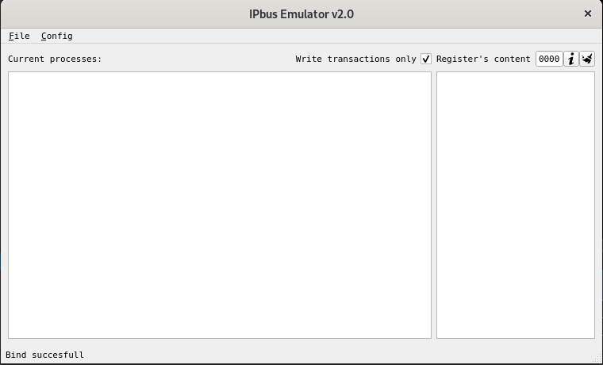

# IPbus target Emulator v3 :computer:

## Описание 
Программа предназначена для эмулирования электронники, работающей по протоколу IPbus v2. При запуске исполняемого файла утилита открывает порт № __50001__ на своём локальном IP-адресе и ждет пакеты по UDP протколу. В слчае если пакет соответствует структуре IPbus, то программа обрабатывает его, формирует и посылает ответ на тот IP-адрес и порт, с которого пришел запрос. Основной документ, описывающий IPbus протокол доступен по [ссылке](https://ipbus.web.cern.ch/ipbus/).

## Документация
Программа, как уже было написано выше, обрабатывает и отвечает на пакеты, пришедшие по UDP протоколу в формате IPbus. Причем пакеты, не соответствующие данному протоколу игнорируются :no_entry:. Приложение способно принимать и распознавать запросы всех трех типов:

* **Status**
* **Control**
* **ReSend**

### Status
На любой статус запрос эмулятор отвечает одинаково, используя шаблон, приведенный ниже:
```
F1 00 00 20
F8 07 00 00
10 00 00 00
F0 02 00 20
0F 0F 0F 0F
0F 0F 0F 0F
0F 0F 0F 0F
0E 07 0F 0F
20 00 00 F0
20 00 00 F0
20 00 00 F0
20 00 00 F0
20 00 00 F0
20 00 00 F0
20 00 00 F0
20 00 00 F0
```

### Control
Приложением могут обрабатываться следующие транзакции в теле Control пакета:

* *write*
* *read*
* *Non-Incrementing write*
* *Non-Incrementing read*
* *RMWsum*
* *RMWbits*

### ReSend
Приложение отчечает на ReSend пакеты солгласно протоколу IPbus без исключений. Эмулятор хранит последние 16 ответных пакетов. В случае переполнения буффера старые пакеты удаляются и заменяются на новые.

## Первый запуск

### Привязка к порту
При первом запуске приложения будет произведена попытка привязки к порту __50001__. В случае если этого сделать не удалось в *status bar* будет выведено сообщение `Bind failed`. Это означает, что данный порт уже занят, поэтому требуется его освободить, то есть закрыть ту программу, которая прослушивает его на данный момент. Повторная попытка привязки к порту **кнопкой `Bind`** в случае успеха выведет в *status bar* сообщение `Bind succesfull`.

### Графический интерфейс


Графический интерфейс состоит из следующих элементов:

* Меню приложения
* Окно лога
* Окно содержания регистров

Ниже приведено описание функционала для каждого элемента интерфейса:

#### Меню приложения


##### File

Опция `File` содержит в себе две функции: сохранение (`Save state`) и загрузка (`Load state`) состояний. Состоянием называется значения регистров в эмуляторе в конкретный момент работы. Файлы состояний представляют собой простой текстовый файл с двумя столбцами. Первый столбец содержит адреса регистров с *ненулевыми значениями*. Второй столбец значение регистра в этом состоянии. Регистры с нулевым значением в файл состояния не записываются. При загрузке файла состояния значения регистров записываются в адрессное пространство эмулятора с корректировкой на поставленные ограничения (конфигурации *конфигурации*). Все значения регистров и их адреса записываютя в **шестнадцатиричной** системе.

##### Config

Опция `Config` позволяет конфигурировать адресное пространство с помощью так называемых *файлов конфигурации*. **Файлы конфигурации** - вспомогательные файлы, устанавливающие правила записи значений в тот или иной регистр. Структура таких файлов показана ниже. В первом стоблюце указывается адрес, на который накладываются ограничения. Второй столбец указывает, можно ли производить запись в этот регистр (`0`) или он только для чтения (`1`).

###### *Замечание*

*Значения во втором столбце ограничивают запись значений в этот регистр только при применении транзакций, подразумевающих запись по текущему адресу. В случае если значение устанавливается файлом сосояния, то данное ограничение игнорируется.*

Четвертый столбец показывает, является ли значение, записываемое в этот регистр знаковым, или нет, то есть при наличии `1` в этом столбце следует воспринимать величину как число, которое может быть отрицательным. В противном случае число всегда неотрицательное.

Пятый и шестой столбцы показывают левую и правую границы значения, которое может быть записано по этому регистру соответственно. В случае, если включена авто-коррекция значения, попытка записать число не попадающе в интервал приведет к его изменению до ближайшей границы. Если авто-коррекция отключена, то значение будет записана чере битовую маску, которая показывает количество и положение эффективных бит. 

Третий столбец указывает на наличие автокоррекции значения регистра. В случае `1` значения, записанные в этот регистр будут изменены в зависимости от диапазона значений, которые могут находиться по этому адресу. 

Пример файла-конфигурации

```
mask : 11
/* This is configuration file to registers restriction in IPbus-target emulator.
_________________________________Descryption:_____________________________________
#RA - REGISTER ADDRESS: The address of register in address space to restrict.

#RO - READ ONLY: 	Set 1 if this register for read only (Set 0 if not).

#RC - RANGE CORRECTION: Set 1 if you want emulator to correct written value.
			Correction is used if the written value out of range.
			Set 0 if you do not want to correct value.
			In this way value will be filter with effective bits mask.

#S  - SIGNED:		Setting 1 means value is signed (Setting 0 means unsigned)

#LB - LOW BORDER:	Shows the minimal possible value in the range.
			It is used in range correction.
			If range correction off LB is 00000000.

#UP - UPPER BORDER:	Shows the maximal possible value in the range.
			It is used in range correction.
			If range correction off UB shows effective bits mask.
 
#RA		#RO 	     #RC	#S	   #LB		#UB	*/
00000000	0	     1	  	1	   fffffb00	00000500
00000001	0	     1	  	1	   fffffb00	00000500
00000002	0	     1	  	1	   fffffc00	00000400
00000003	0	     0	  	0	   00000000	0000dfff
00000004	0	     0	  	0	   00000000	0000000f
00000005	1	     0	  	1	   00000064	00000258
***
```
Здесь, например, мы можем читать конфигурации так: Значение по адресу 0x1 знаковое, его можно считать и записать. Оно может находиться в диапазоне `[-1024; 1024]`. В случае выхода за пределы диапазона, будет произведена корректировка до ближайшей границы. А, например, значение регистра с адресом 0x5, который в реальной плате отвечает за температуру, знаковое в диапазоне от 100 до 600, можно будет только считать.

В шапке файла имеется маска. Маска нужна для разметки подключенных к TCM модулей. Например в приложенном фрагменте файла `11` означает, что подключены PMA0 и PMA1. В зависимости от того, какое число PM и в какие слоты подключены, конфигурация эмулятора применяется к разным регистрам. Это число может быть в двоичном или шестнадцатиричном виде.

#### Окно логов
Большое окно слева предначзначено для системных сообщений (логов). Формат логов приведен ниже:
```
<19:45:23> Status packet  ( 16 words BE)
<19:45:23> Control packet (  4 words LE)
writing 0x80000000 to 0x0000001B (sequental)
<19:45:31> Status packet  ( 16 words BE)
<19:45:31> Control packet (  3 words LE)
reading   2 words from 0x000002C0 (sequental)
<19:45:31> Status packet  ( 16 words BE)
<19:45:31> Control packet (  3 words LE)
reading   2 words from 0x000002C0 (sequental)
<19:45:31> Status packet  ( 16 words BE)
<19:45:31> Control packet (  3 words LE)
reading   2 words from 0x000002C0 (sequental)
<19:45:32> Status packet  ( 16 words BE)
<19:45:32> Control packet (  3 words LE)
reading   2 words from 0x000002C0 (sequental)
<19:45:42> Status packet  ( 16 words BE)
<19:45:42> Control packet (  4 words LE)
writing 0x00000004 to 0x00000050 (sequental)
<19:45:46> Status packet  ( 16 words BE)
<19:45:46> Control packet (  3 words LE)
reading  16 words from 0x00000000 (sequental)
<19:45:47> Control packet (  3 words LE)
reading   1 words from 0x00000050 (sequental)
```
 
 В треугольных скобках указывается временной штамп со временем, когда пришел пакет. Далее прописывается тип пакета, в скобках его объем в 32-битных словах и порядок байт, в котором пришел пакет. Ниже указывается, что делается с тем или иным регистром. Перечисляется какое значение в какой регистр и в каком режиме записывается. `Sequental` и `non-incrementing` режимы, соответствуют последовательной и FIFO записям. При чтении выводится сообщение, содежащее количество считываемых слов, адресс, откуда они считываются и режим. По умолчанию статус пакеты и транзакции чтения не отображаются, однако в файл они записываются. Увидеть их можно если убрать галочку выше в окне `Write transaction only`.
 
 #### Окно значений
 В окне справа можно увидеть текущее состояние регистра в его адресном пространстве. Для этого достаточно ввести его адрес в поле ввода сверху или выбрать с помощью кнопок `▲` и `▼`, после чего нажать `Enter`. В поле появится значение текщего регистра в формате:
 `
 [0xaddress] = 0xvalue
 `
 Окно для удобства можно очистить, нажав кнопку очистки сверху. Также по введенному адресу регистра в поле ввода можно узнать его ограничения, если они были введены. Для этого необходимо нажать на кнопку с иконкой "i". Информация об ограничения высветится в `status bar`
 
 #### Горячие клавиши
 
 * Получить информацию о конфигурации регистров 	- `Ctrl + I`
 * Очиcтить поле значений регистров			- `Ctrl + E`
 * Выйти из программы 					- `Ctrl + Q`
 * Повторно привязаться к порту 			- `Ctrl + B`
 * Выводить (скрыть) транзакции чтения в окно лога 	- `Ctrl + W`
 * Изменить меню на `toolbar` и наоборот 		- `Ctrl + T`
 
 
